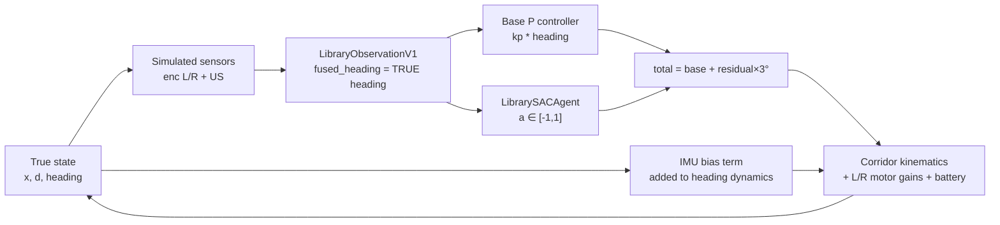

# Adaptation Locus System Audit (Phase-0 Precondition)

**Date:** 2026-09-05 (Asia/Singapore)  
**Repository:** [12412825-collab/cc-hackers-s-RL-robotics-project](https://github.com/12412825-collab/cc-hackers-s-RL-robotics-project)  
**Local root:** `C:\Users\Sichang Yang\Downloads\cc+hacker final`  
**Branch at audit:** `research/adaptation-locus-phase0` (forked from `main` @ `ead5355`)  
**Mode:** read-only reconstruction of the existing system. Historical code was not modified for this audit.

---

## 1. Executive finding

The repository contains **two residual-RL stacks** that are only loosely coupled:

| Stack | Role | Train / eval env | Observation | Closed into Webots / `manage.py`? |
|-------|------|------------------|-------------|-----------------------------------|
| **A. Library sensor-only SAC** | Straight-corridor residual heading | `LibraryCorridorEnv` | 5-dim `library-observation-v1` | **No** |
| **B. DonkeyCar visual SAC** | Vision residual angular correction | Tub offline (no online env) | image ± 9-dim sensors | **Yes** (if `RESIDUAL_RL=True`) |

**Phase-0 decision:** use Stack A (`library_residual` + `LibraryCorridorEnv`) as the controlled laboratory. Stack B is deployment scaffolding and is **not** the Phase-0 experimental apparatus.

Critical scientific gap in the historical Stack A environment:

1. `fused_heading_error` is the **true** simulator heading (`env.py` `_get_observation`).
2. `imu_bias` is applied as a **dynamics** drift term (`heading_change += imu_bias * dt`), not as an observation/estimation mismatch.
3. There is **no online estimator / calibration adaptation locus**.
4. Encoder scale mismatch is **not** parameterized (noise σ only).

Phase-0 therefore requires a **new modular experiment layer** that preserves historical files and corrects the observation/dynamics separation for the study. It must not silently “improve” the historical baseline used for prior hackathon demos.

---

## 2. Control-path diagrams

### 2.1 Intended historical Library residual path (docs)

```text
true pose / motion
  → Arduino encoders + MPU6500 (+ ultrasonic)
  → fused heading (encoder + IMU)   [documented on Mega; NOT in this repo]
  → base PID heading controller     [documented; NOT in this repo]
  → residual SAC (±10 PWM)          [library_residual]
  → SET_RL_CORRECTION               [documented protocol; not wired here]
  → motors
```

### 2.2 Actual in-repo Library SAC path (`LibraryCorridorEnv`) — Phase-0 candidate



Exact step order (`library_residual/env.py`):

```text
true (x, d, heading)
  → base_correction = clip(kp * heading, ±30°)          [lines 160–164]
  → residual = action * 3.0°                            [lines 166–168]
  → heading += -total*dt*0.1 + imu_bias*dt              [lines 171–178]
  → left/right speeds *= gains * battery                [lines 180–185]
  → encoder distances += speed*dt + N(0, 0.1)           [lines 187–195]
  → update (d, x); reward / terminate                   [lines 197–298]
  → observation uses TRUE heading as fused_heading      [lines 310–316]
```

### 2.3 Webots / DonkeyCar deployment path (out of Phase-0 scope)

```text
Webots physics (FourWheelRobot)
  → WebotsAdapter sensors (cam, enc, IMU, US, pos)
  → SensorFusion → 9-dim sensor/observation
  → KerasPilot base → pilot/angle, pilot/throttle
  → ResidualPilot (optional) → residual ω
  → VelocityDriveMode: ω = ω_base + residual_ω
  → DifferentialDriveKinematics → wheel rad/s
  → WebotsAdapter.run → motors.step
```

Wiring: `manage.py` (~305–313 fusion, ~467–484 residual, ~520–542 velocity, ~952–971 Webots).  
Defaults: `RESIDUAL_RL=False`, `SIMULATOR='none'` (`myconfig.py`).

---

## 3. Component inventory (exact references)

### 3.1 Simulation environments

| Component | Path | Symbols / lines |
|-----------|------|-----------------|
| Corridor env | `library_residual/env.py` | `CorridorConfig` 35–81; `LibraryCorridorEnv` 84–332; eval helpers 340–404 |
| Webots world | `simulation/worlds/four_wheel_track.wbt` | `basicTimeStep 50` |
| Robot PROTO | `simulation/protos/FourWheelRobot.proto` | wheel R=0.0325, sep=0.130, torque=0.12; accel/gyro noise |
| Webots adapter | `simulation/webots_adapter.py` | `WebotsAdapter` sensors + motors |
| Extern controller | `simulation/controllers/donkey_webots/donkey_webots.py` | launches `manage.py drive` |

Duplicate assets also exist under `WebotsRobotProject/` (legacy mirror).

### 3.2 Sensor generation

| Sensor | Historical Stack A | Historical Stack B |
|--------|--------------------|--------------------|
| Encoders | Distance integration + σ=0.1 cm (`env.py` 180–195) | `WebotsAdapter._wheel_speeds` 142–163; `EncoderSensor` in `parts/sensors.py` |
| IMU | Bias on heading dynamics only (`env.py` 174–178) | Accel/gyro channels; `IMUSensor` with offline `calibrate()` |
| Ultrasonic | `wall_distance - d` (`env.py` 203–206) | DistanceSensor × 100 cm |
| Fusion | **None** (true heading exposed) | `SensorFusion` 9-dim layout `[enc2\|imu6\|us1]` |

### 3.3 Calibration constants

| Constant | Value | Location |
|----------|-------|----------|
| `ENCODER_MM_PER_TICK` | 12.7625 | `parts/sensors.py` `SensorConfig` |
| IMU accel/gyro ranges | ±2 g / ±250 °/s | `SensorConfig` |
| IMU EMA α | 0.8 | `IMUSensor` |
| Offline IMU bias | `calibrate(num_samples=500)` | `IMUSensor.calibrate` — **not online** |
| Observation norms | see `library_residual/types.py` FEATURE_NORM | heading ±45°, enc ±10 cm, US 0–400 cm |

### 3.4 Base controller

| Context | Implementation | Gains |
|---------|----------------|-------|
| LibraryCorridorEnv | **P-only** `kp * heading` | `base_heading_kp=1.5`, clip ±30° |
| Donkey path follower | Config only | `PID_P=-10`, `I=0`, `D=-0.2` (`config.py`) |
| Arduino Mega fused-heading PID | Documented in `docs/LIBRARY_ROBOT_MINIMAL_SAC.md` | **Not present in this repository** |

### 3.5 Residual SAC

| Piece | Path | Defaults |
|-------|------|----------|
| Actor / Critic / Agent | `library_residual/policy.py` | 5→64→64; lr 3e-4; γ 0.99; τ 0.005 |
| Replay buffer | `SensorReplayBuffer` | capacity 100_000 |
| Safety wrapper | `library_residual/safety.py` | modes disabled/shadow/active; ±10 PWM |
| Bundle export | `library_residual/bundle.py` | actor.ts, checkpoint.pth, manifest |
| Train entry | `train_library_sac.py` | 50k steps, seed 42, warmup 1k |
| Visual SAC (Stack B) | `parts/residual_rl.py` | MobileNet + optional 9-dim sensors |

### 3.6 Reward / termination / randomization (`CorridorConfig`)

**Reward weights:** progress +1.0; heading improvement +0.5; heading error −0.3; encoder diff −0.2; residual action −0.1; action change −0.05.  
**Terminals:** success +10 (×0.5 if drift); collision −20; heading −15; corridor −15; stall −10; max_steps 200.  
**Reset randomization:** direction ±1; heading (−5°,+5°); lateral (−3,+3) cm; L/R gains (0.9,1.1); IMU bias (−1,+1) °/s; battery (0.85,1.0).

### 3.7 Evaluation / checkpoints / logs

| Item | Location |
|------|----------|
| Eval scenarios | `make_eval_scenarios` / `run_eval_episode` in `env.py` |
| Training log | `models/library_sac_50k/training_log.json` (and siblings) |
| Manifest / norms | `models/library_sac_*/manifest.json`, `normalization.json` |
| **Missing artifacts** | `actor.ts` / `checkpoint.pth` not present under checked-in model dirs |

### 3.8 Config files

| File | Role |
|------|------|
| `myconfig.py` | Project overrides (RL, Webots, sensors, COM port) |
| `config.py` | Stock DonkeyCar defaults |
| `myconfig.pi.py` | Pi physical profile |

### 3.9 Tests (existing)

`tests/test_library_residual.py`, `test_sensor_fusion.py`, `test_webots_adapter.py`, `test_differential_drive.py`, `test_webots_assets.py`, `test_dataset_quality.py`, `test_arduino_serial.py`.

---

## 4. Mismatch knobs already present vs Phase-0 needs

| Mismatch | In `LibraryCorridorEnv` today? | Scientifically correct as observation mismatch? | Phase-0 action |
|----------|--------------------------------|--------------------------------------------------|----------------|
| IMU heading bias | Yes (`imu_bias_range_deg_s`) | **No** — applied to dynamics | Re-model as observation/estimation bias in research env |
| Motor L/R gain asymmetry | Yes (independent uniform draws) | Yes (dynamics) | Freeze as controlled δ asymmetry |
| Encoder scale | No (noise only) | N/A | Optional secondary; IMU remains primary |
| Battery effectiveness | Yes | Dynamics confound | **Disable** for Phase-0 |
| Heading / lateral init | Yes | Episode IC, not mismatch family | Freeze for Phase-0 controlled runs |

| Adaptation locus | Exists today? | Phase-0 |
|------------------|---------------|---------|
| A0 none | Default frozen controller | Keep |
| A1 estimator / calibration | **No** online | **Add** low-dim bias / fusion adaptation |
| A2 residual policy | Library SAC offline train | Online residual adaptation with frozen sensors/base |

---

## 5. Frozen historical baseline values (nominal robot)

These are the **recorded** defaults of the existing corridor laboratory. Phase-0 must not silently retune them for nicer plots.

| Parameter | Frozen value |
|-----------|--------------|
| `segment_length_cm` | 100.0 |
| `corridor_half_width_cm` | 15.0 |
| `max_steps` | 200 |
| `dt` | 0.1 s |
| `base_speed_cm_s` | 20.0 |
| `wheel_track_cm` | 18.0 |
| `base_heading_kp` | 1.5 |
| `max_base_correction` | 30.0 |
| `max_residual_deg` | 3.0 (hard-coded in `step`) |
| `ultrasonic_stop_threshold_cm` | 20.0 |
| `max_heading_error_deg` | 45.0 |
| Reward weights | as in §3.6 |
| Historical train seed | 42 |
| Historical SAC hyperparams | lr 3e-4, γ 0.99, τ 0.005, hidden 64 |

Phase-0 will **override randomization** (set explicit mismatch severities; disable battery DR) inside the research layer while keeping the above controller/reward structure unless a change is explicitly logged in the preregistration.

---

## 6. Risks for Phase-0 (skeptical reviewer view)

1. **Observation/dynamics confound in historical IMU bias** — must be fixed in the research env or H1 is uninterpretable.
2. **No true estimator** — A1 cannot be “existing calibration”; it must be newly defined and kept low-dimensional.
3. **Privileged state** — if A1 uses true heading, it is an oracle; must offer realistic vs oracle variants and mark them.
4. **Incomplete checkpoints** — residual adaptation may need a fresh short pretrain under the Phase-0 nominal env rather than loading missing `actor.ts`.
5. **Reward-shaped success** — historical eval often reports success_rate ≈ 1.0 while returns oscillate; Phase-0 must emphasize tracking / effort / recovery metrics, not only RL return.
6. **Two pipelines** — do not mix Webots visual SAC results into the Phase-0 matrix.
7. **Residual unit mismatch** — train ±3°, deploy ±10 PWM, Webots ±0.75 rad/s; Phase-0 stays in corridor degrees.

---

## 7. Phase-0 plant note (declared correction)

Historical `LibraryCorridorEnv` updates heading via an abstract correction term and does **not** integrate yaw from \((v_R-v_L)/\mathrm{track}\). Under that plant, motor gain asymmetry mainly affects encoder difference, not true heading — which would make H2 uninterpretable.

The Phase-0 research environment (`research/adaptation_locus/env.py`) therefore closes the plant with differential-drive yaw integration while retaining historical controller gains, residual bound (±3°), reward weights, and episode geometry. This is an explicit scientific correction, not a silent baseline “improvement” of the historical demo code.

## 8. Audit conclusion

The reconstructible, configurable laboratory for Phase-0 is **`LibraryCorridorEnv` defaults + `LibrarySACAgent` machinery**, not the Webots visual stack. The historical path provides motor asymmetry and a (scientifically mis-placed) IMU bias knob, a P-base + residual controller, and full reward/termination scaffolding. Estimator adaptation and a clean observation-vs-dynamics separation **did not exist** at audit time and are added only under `research/adaptation_locus/`.

**No production system files were modified to produce this audit.**
