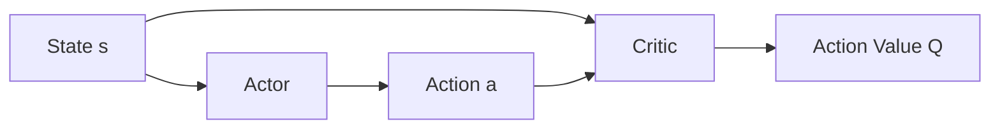
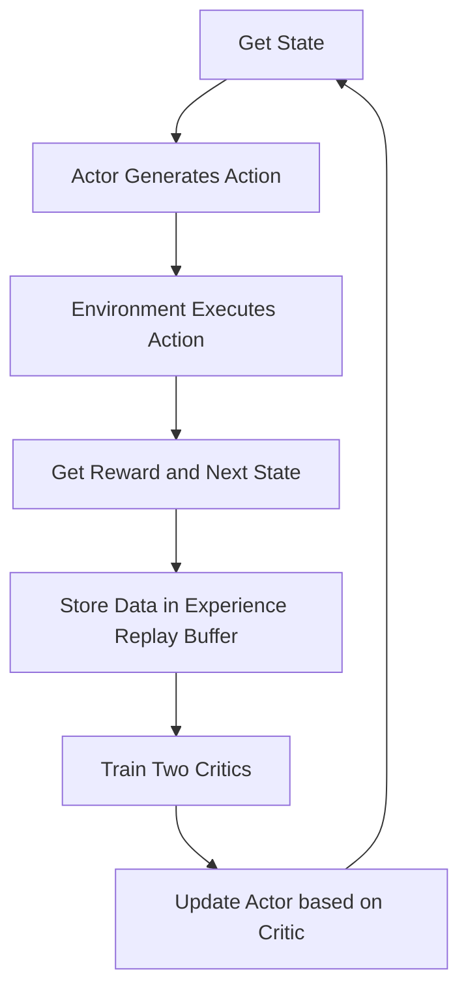

## What does SAC do

SAC stands for **Soft Actor-Critic**, which is a reinforcement learning algorithm primarily used for **continuous action control**.

It is suitable for handling continuous values like steering angle, throttle, speed, etc. For example, the steering of an autonomous car can be represented as:

$$
a_t\in[-1,1]
$$

SAC allows the agent to continuously interact with the environment, learning what action to output in different states to obtain higher long-term rewards.

In the car project:

- State $s_t$: Camera image, speed, lateral deviation, etc.;
- Action $a_t$: Steering angle or throttle;
- Reward $r_t$: Forward reward, centering reward, collision penalty, etc.

---

## Core Principles of SAC

The core of SAC is the **Actor-Critic** structure.

### Actor

The Actor is the policy network, responsible for generating actions based on the state.

The Actor in SAC does not output a completely fixed action, but rather a probability distribution of actions:

$$
a_t\sim\pi(a_t|s_t)
$$

Therefore, it can both choose the current best action and explore other nearby actions.

### Critic

The Critic is the value network, responsible for evaluating the action generated by the Actor:

$$
Q(s_t,a_t)
$$

The larger $Q(s_t,a_t)$ is, the better the long-term effect of executing action $a_t$ in state $s_t$.

The Actor continuously improves its actions based on the Critic\'s evaluation, while the Critic continuously improves its evaluation accuracy based on the rewards returned by the environment.

---

## Maximum Entropy Concept

Normal reinforcement learning mainly pursues higher rewards, while SAC simultaneously pursues:

$$
\text{High Reward}+\text{Appropriate Policy Randomness}
$$

Its objective can be simply expressed as:

$$
J(\pi)
=
\mathbb{E}
\left[
\sum_{t=0}^{\infty}
\gamma^t
\left(
r_t+\alpha\mathcal{H}(\pi)
\right)
\right]
$$

Where:

- $r_t$ is the environmental reward;
- $\mathcal{H}(\pi)$ is the policy entropy, representing the degree of randomness of the policy;
- $\alpha$ controls the importance of exploration;
- $\gamma$ is the discount factor.

> [!IMPORTANT]
> SAC doesn\'t just learn the "current best action", it also retains a certain exploration capability to avoid prematurely falling into a local optimum.

---

## Why use two Critics

SAC typically uses two Critics:

$$
Q_1(s,a)
$$

$$
Q_2(s,a)
$$

During calculation, it takes the smaller of the two:

$$
Q_{\min}(s,a)
=
\min
\left(
Q_1(s,a),
Q_2(s,a)
\right)
$$

This can reduce the Critic\'s overestimation of the value of certain actions, making training more stable.

---

## SAC Training Process

SAC saves the interaction data as:

$$
(s_t,a_t,r_t,s_{t+1})
$$

Then it randomly samples data from the experience replay buffer to repeatedly train the Actor and Critic, thus having a high data utilization rate.

---

## Role in Residual Reinforcement Learning Car

In residual reinforcement learning, SAC is not directly responsible for all driving, but learns to correct the base model\'s actions:

$$
a_{\text{final}}
=
a_{\text{base}}
+
\lambda a_{\text{SAC}}
$$

Where:

- $a_{\text{base}}$ is the base action output by the behavior cloning model;
- $a_{\text{SAC}}$ is the residual correction learned by SAC;
- $\lambda$ is used to limit the magnitude of the correction.

> [!SUMMARY] Summary
> SAC is an Actor-Critic algorithm suitable for continuous control. The Actor generates actions, the Critic evaluates actions, and the maximum entropy mechanism balances exploration and exploitation. In the car project, it can learn steering or throttle control, or simply learn the amount of correction to the base model.
